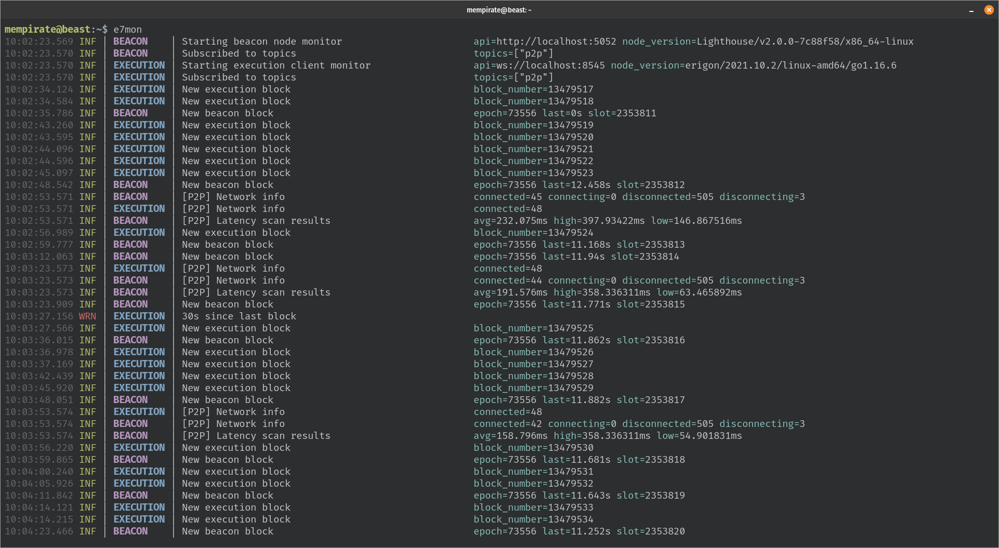

# e7mon

Tool for monitoring your Ethereum clients. Client-agnostic as it queries the standardized JSON-RPC APIs.
Requires the following APIs to be exposed on your execution client:
* `eth`: querying the chain
* `net`: getting P2P stats
* `web3`: client information



## Installation
**From source**
Install dependencies:
```bash
sudo apt-get install libpcap-dev build-essential
```
Build the binary:
```bash
git clone https://github.com/eth-tools/e7mon
cd e7mon
make install
```
This will put the binary in $GOBIN, which is in your PATH.

## Usage
First, generate the YAML config file. This is included in the binary and will be written to `$HOME/.config/e7mon/config.yml`.
```bash
e7mon init
```
Next up, change the config to match your settings and preferences. Important to fill out is the correct API endpoint for each client.

Now run the monitor program:
```bash
# Monitor both clients
e7mon

# Execution client only
e7mon execution

# Beacon node only
e7mon beacon
```

Use the help command for all the options:
```
e7mon help

NAME:
   e7mon - Monitors your Ethereum clients

USAGE:
   e7mon [global options] command [command options] [arguments...]

COMMANDS:
   init       initializes configs
   execution  monitors the execution client (eth1)
   beacon     monitors the beacon node (eth2)
   help, h    Shows a list of commands or help for one command

GLOBAL OPTIONS:
   --help, -h  show help (default: false)
```

## Features
* Block monitor with options
* Statistics loop with options
* Beacon node P2P network stats with `e7mon beacon p2pstat`

## Disclaimer
This is alpha software. If you find bugs, please submit an issue. Things can and will break.

## Todo
- [ ] Think about all the different config options
* Finalized checkpoints
* Attestations
- Execution monitor
	- [x] Block monitor
	- [x] P2P stats
      - [ ] Peers avg latency
	- [ ] More generic stats

- Beacon monitor
	- [x] Block monitor
	- [x] P2P stats
      - [ ] Peers avg latency
	- [ ] More generic stats
- Validator monitor
   - [ ] Produced blocks
   - [ ] Validator stats
- [ ] Implement verbosity levels
- [ ] Integrate with beaconcha.in
- [ ] Write API connectors for message services

Sources:
* https://ethereum.github.io/beacon-APIs/#/
* https://geth.ethereum.org/docs/rpc/server
* https://notes.ethereum.org/@serenity/handbook
* https://github.com/ethereum/consensus-specs
* https://github.com/ethereum/consensus-specs/blob/dev/specs/phase0/beacon-chain.md
* https://github.com/grahamking/latency
* https://github.com/attestantio/go-eth2-client

TCP-SYN-ACK latency with eBPF:
* https://blog.cloudflare.com/epbf_sockets_hop_distance/
* https://pkg.go.dev/github.com/cilium/ebpf
